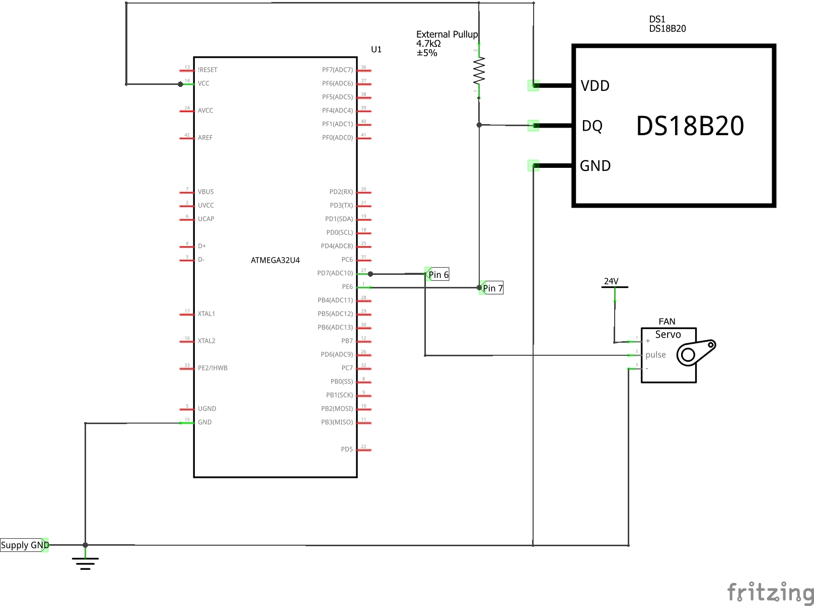

# ActiveCooler

Program that configures MCU's timer registers to sample sensor data and output PWM to an HVAC cooling fan

## Hardware
Device: SparkFun Pro Micro 5V/16MHz (Atmega32U4)

Temperature Sensor: DS18B20

Fan: SanAce 92W XF-P05801, DC 24V/1.0A

- https://www.mouser.com/datasheet/2/471/San_Ace_92WL38_E-1316567.pdf

Voltage Regulator: TRACO THD 12-4812WI, DC 18-75V In, 12V/1000ma Out

- https://www.mouser.com/ProductDetail/TRACO-Power/THD-12-4812WI?qs=ckJk83FOD0X7VPMTWOOrrA%3D%3D 

## Libraries used:
https://github.com/milesburton/Arduino-Temperature-Control-Library

https://github.com/PaulStoffregen/OneWire

## Notes
1. Make sure your Arduino IDE is setup for uploading code to the SparkFun Pro Micro Board:

    - https://learn.sparkfun.com/tutorials/pro-micro--fio-v3-hookup-guide/all

    - https://cdn.sparkfun.com/datasheets/Dev/Arduino/Boards/ProMicro16MHzv1.pdf

2. The code simply uses the linear mapping function map() to map temperatures to motor speeds
    
    - Motor speeds range from 0-100% duty cycle (0-100)

    - Exposed parameters are defined at the top of the code

        - MOTOR_MIN, MOTOR_MAX

        - TEMP_MIN, TEMP_MAX

3. Error Catching (In both cases, fan is turned off):

    - When sensor's sense wire is disconnected from MCU

    - When sensor itself is disconnected from ground and power

4. Exposed a parameter (SAMPLING_PERIOD) for changing sensor update rate (In miliseconds)

## Wiring Schematic:

## Final Assmebly:

