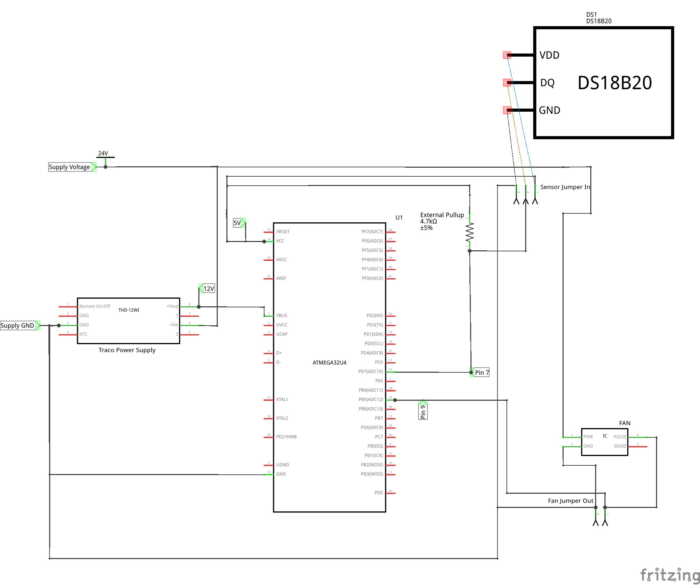

# ActiveCooler

Program that configures MCU's timer registers to match PWM Frequency requirements of HVAC cooling fans
and actuates them based on temperature sensor readings

## Hardware
Device: SparkFun Pro Micro 5V/16MHz (Atmega32U4)

Temperature Sensor: DS18B20

Fan: SanAce 92W XF-P05801, DC 24V/1.0A

## Libraries used:
https://github.com/milesburton/Arduino-Temperature-Control-Library

https://github.com/PaulStoffregen/OneWire

## Notes
1. Make sure your Arduino IDE is setup for uploading code to the SparkFun Pro Micro Board:

    - https://learn.sparkfun.com/tutorials/pro-micro--fio-v3-hookup-guide/all

    - https://cdn.sparkfun.com/datasheets/Dev/Arduino/Boards/ProMicro16MHzv1.pdf

2. The code simply uses the linear mapping function map() to map temperatures to motor speeds
    
    - Motor speeds range from 0-100% duty cycle (0-100)

    - Exposed parameters are defined at the top of the code

3. Error Catching (In both cases, fan is turned off):

    - When sensor's sense wire is disconnected from MCU

    - When sensor itself is disconnected from ground

4. No error catching for when sensor is disconnected from power

## Wiring Schematic:

